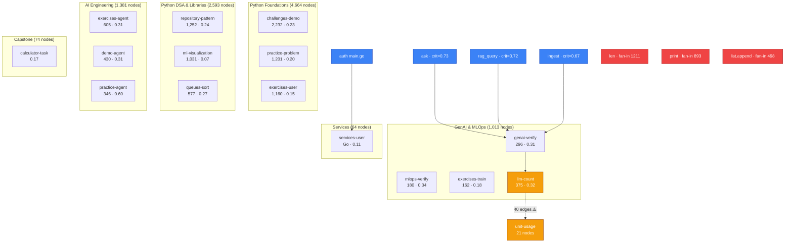

# Code Intelligence

Multi-layered code intelligence powered by codebase-memory-mcp and repomix.

## Status

| Layer | Status | Details |
|-------|--------|---------|
| **Structural Graph** | ✅ Indexed | `D-AI-Projects-fullstack-ai-engineer-lab`, 53,200 nodes, 125,156 edges, 8 languages |
| **Review Graph** | ✅ Built | 11,590 nodes, 87,721 edges, 23 communities, 1,147 flows |
| **Multimodal Graph** | ✅ Built | 49,856 nodes, 54,483 edges, 2,833 communities (AST-only, no LLM) |
| **Context Pack** | ✅ Ready | 1,244,995 tokens (compressed), 1,082 files |
| **Watcher** | ⏳ Manual | Re-index with `codebase-memory index_repository` |

## Architecture



### Key Hotspots

| Symbol | Type | Fan-in | Why |
|--------|------|--------|-----|
| `print` | builtin | 893 | Used everywhere for output |
| `len` | builtin | 1,211 | Most-called function in Python exercises |
| `list.append` | builtin | 498 | Core data structure operation |
| `Printable.print` | method | 490 | ABC pattern demo in `08-abc` |
| `HashTable.items` | method | 234 | DSA hash table exercise |
| `DatabaseConnection.execute` | method | 187 | Context manager exercise |

### Cross-Package Boundaries

| From | To | Calls |
|------|----|-------|
| 00-core-foundations | (builtins) | 2,026 |
| 04-ai-engineering | 00-core-foundations | 377 |
| 04-ai-engineering | (builtins) | 841 |
| 00-core-foundations | 04-ai-engineering | 228 |

### Clusters (12 from codebase-memory)

| Cluster | Size | Cohesion | Dominant |
|---------|------|----------|----------|
| 3 | 480 | 0.45 | len, range, copy, _verify, main |
| 2 | 470 | 0.54 | append, str, search, resolve, main |
| 7 | 421 | 0.57 | print, close, sin, llm_call, _verify_async |
| 112 | 267 | 0.73 | connect, Session, close, execute, add |
| 52 | 228 | 0.76 | get, filter, query, info, render |
| 12 | 227 | 0.59 | list, select, where, run, _verify |
| 10 | 224 | 0.60 | append, get, run_communication_demo, add_task |

### Communities (23 from code-review-graph)

| Community | Size | Cohesion | Language |
|-----------|------|----------|----------|
| challenges-demo | 2,232 | 0.23 | Python |
| 10-repository-pattern-verify | 1,252 | 0.24 | Python |
| practice-problem | 1,201 | 0.20 | Python |
| exercises-user | 1,160 | 0.15 | Python |
| 23-ml-visualization-exercise | 1,031 | 0.07 | Python |
| exercises-agent | 605 | 0.31 | Python |
| 04-queues-sort | 577 | 0.27 | Python |
| exercises-demo | 538 | 0.25 | Python |
| exercises-demo-agent | 430 | 0.31 | Python |
| llm-count | 375 | 0.32 | Python |
| practice-problem-agent | 346 | 0.60 | Python |
| 09-genai-verify | 296 | 0.31 | Python |
| 08-mlops-verify | 180 | 0.34 | Python |
| exercises-train | 162 | 0.18 | Python |
| 01-calculator-task | 74 | 0.17 | Python |
| services-user | 64 | 0.11 | Go |

### God Nodes (graphify, top 10)

| Node | Edges | What it is |
|------|-------|------------|
| `RedisClient` | 110 | Redis connection wrapper (capstone infra) |
| `main()` | 100 | Entry points across all exercises |
| `Session` | 94 | SQLAlchemy session (database exercises) |
| `SpyClient` | 31 | Testing mock (observability exercises) |
| `Glossary: Data Ethics` | 31 | fast.ai lecture glossary |
| `BST` | 29 | Binary search tree (DSA) |
| `AVLTree` | 26 | Self-balancing tree (DSA) |
| `Detailed Definitions` | 29 | fast.ai glossary node |
| `Terms` | 28 | fast.ai glossary node |
| `Definitions` | 27 | fast.ai glossary node |

## Quick Reference

| Question | Tool call |
|----------|----------|
| Who calls X? | `codebase-memory_trace_path(function_name="X", direction="inbound")` |
| What does X call? | `codebase-memory_trace_path(function_name="X", direction="outbound")` |
| Find by pattern | `codebase-memory_search_graph(name_pattern=".*X.*")` |
| Dead code | `codebase-memory_search_graph(max_degree=0)` |
| Impact of changes | `codebase-memory_detect_changes(project="D-AI-Projects-fullstack-ai-engineer-lab")` |
| Blast radius | `code-review-graph_detect_changes_tool(detail_level="minimal")` |
| Critical flows | `code-review-graph_list_flows_tool(sort_by="criticality", detail_level="minimal")` |
| Community details | `code-review-graph_get_community_tool(community_name="X")` |
| God nodes | `graphify_god_nodes()` |
| Shortest path | `graphify_shortest_path(from="X", to="Y")` |
| Pack for LLM | `repomix_pack_codebase(path="D:\\AI\\Projects\\fullstack-ai-engineer-lab")` |

## How to re-index

```bash
# Structural graph (codebase-memory-mcp)
codebase-memory index_repository --repo_path D:\AI\Projects\fullstack-ai-engineer-lab --mode full

# Review graph (code-review-graph)
# Built automatically on first query, or trigger manually:
code-review-graph build_or_update_graph_tool

# Multimodal graph (graphify)
graphify update . --force
```

## What it covers

- **Python** (899 files): Core, advanced, libraries, databases, web frameworks, DSA, ML, MLOps, GenAI exercises and capstones
- **Go** (17 files): Auth, user, chat microservices with chi router, pgx, JWT
- **Markdown** (extensive): Lectures, quizzes, exercises, ADRs, learning paths, deep dives
- **HTML/CSS/JS** (13 files): Dashboard templates, static assets
- **YAML** (8 files): Docker Compose, CI/CD, registries
- **SQL** (1 file): Postgres init script

## Agent tiers

| Tier | When to use | Tools |
|------|-------------|-------|
| **Scout** | Quick lookup, provisional | graph + repomix tools |
| **Verify** | Task-directed evidence | graph + coverage checks |
| **Auditor** | Full bounded verification | All tools, complete pagination |
